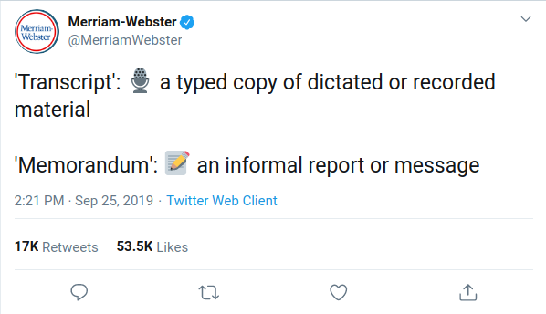

# The Phone Call

The infamous phone call that took place on July 25, 2019 between 9:03 - 9:33
am EDT between the US President Donald J. Trump and the newly elected President
of Ukraine, Volodymyr Zelenskyy. After revelations of potential improprieties
of Preident Trump by an anonymous whistle blower, a memorandum of the phone call
was released by the White House on September 24, 2019. This phone call
eventually led to Donald J. Trump to becoming the third US President to be
impeached.

This repository contains
- a text version of the memorandum that was obtained by using OCR
- a cleaned version of the text memorandum (no edits to the contents of the
  phone call were made, I only cleaned up artifacts from the conversion process
  and moved non-phone call related text to spots that I felt made sense)
- scripts used to download the memorandum and convert it to images
- a script used to obtain the text version of the memorandum from the images

The reason that I used OCR to pull the text from the PDF is that the text in
the document didn't copy and paste very well and the results from the OCR were
much better.

## Goal

The goal here isn't to play partisan politics. The is to have this information
in another, hopefully accessible, format.

## An Aside

You'll note that I use the word "memorandum" instead of "transcript." This is
because the document given out by the Trump administration is most definitely
***not*** a transcript, it is a ***memorandum***. One day after the release of
the memorandum (September 25, 2019), Merriam-Webster
[tweeted](https://twitter.com/MerriamWebster/status/1176864243867619334) the
definitions of memorandum and transcript which is pictured below.

> 'Transcript': 🎙 a typed copy of dictated or recorded material
> 'Memorandum': 📝 an informal report or message
> Merriam-Webster (September 25, 2019)

The reason that I make this distinction is because this memorandum is a
reconstruction of what was said in the phone call which would make this
document **not** a transcript, but a memorandum. Take a look at the CAUTION
that is at the bottom of the first page of the document

> CAUTION: A Memorandum of a Telephone Conversation.· (TELCON) is not a verbatim
transcript of a discussion. The text in this document records the notes and
recollections of Situation Room Duty "Officers and-NSC policy staff assigned to
listen and memorialize the conversation in written form as the conversation
takes place. A number of factors can affect 'the accuracy of the record,
including poor telecommunications connections and variations in accent and/or
interpretation. The word "inaudible" is used to indicate portions of a
conversation that the notetaker was unable to hear.

The document *itself* notes that it is "not a verbatim transcript of a
discussion."

## Requirements

- Python 3.8.0 (you can probably get away with using another version as long as
  it's 3.6+)

### Development Requirements

- Pillow
- PyOCR
- Tesseract OCR

## How to Use the Scripts

*I used Ubuntu, so substitute the commands for equivalent ones on the platform
that you're on.*

Obtain the memorandum

`./download.sh`

Convert it to images

`./pdf_to_images.sh`

Run the script to extract the text from the images

`python pdf_to_text.py`

